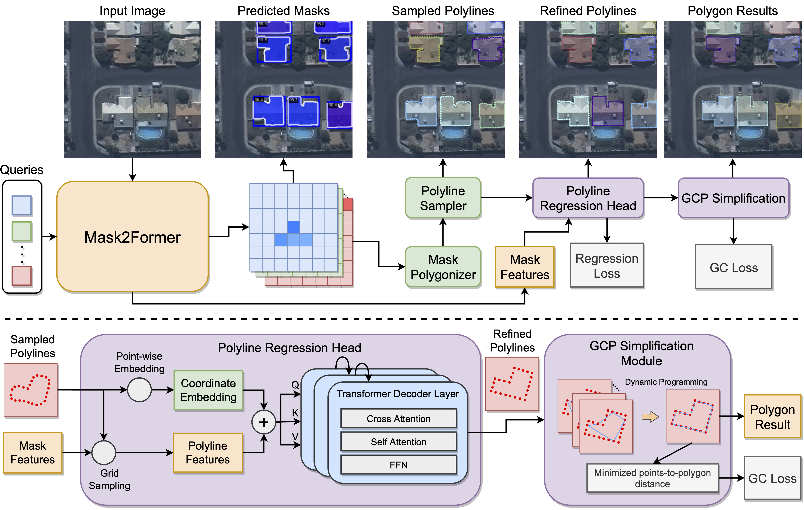

Official Implementation of Zhang, Fahong, Yilei Shi, and Xiao Xiang Zhu. "Global Collinearity-aware Polygonizer for Polygonal Building Mapping in Remote Sensing." arXiv preprint arXiv:2505.01385 (2025).
To re-implement the model in the paper, please follow the bellow steps.



## Datasets preparation
1. Crowd AI dataset
   Download the dataset at https://www.aicrowd.com/challenges/mapping-challenge/dataset_files
   
   Unzip train.trg.gz and val.trg.gz, and place them in your data folder.
   
   Modify the configuration file in config/_base_/crowd_ai_bs16.py. Change "data_root" attribute in line 3 to your data folder.
   
   Make sure that in train, val and test dataloader settings in line 62, 79 and 96, data_root + ann_file and correctly locate your annotation file, and data_root + data_prefix and locate your image folder.
   
3. Whu-Mix-Vector dataset
   Download the dataset at http://gpcv.whu.edu.cn/data/whu-mix%20(vector)/whu_mix(vector).html

   Unzip four downloaded files: "train.zip" "val set.zip", "test set 1.zip" and "test set 2.zip" and place them in your data folder. Then modify the configuration file in config/_base_/whu_mix_vector accordingly just like CrowdAI dataset.

## Test with the provided model weights

The model weights are available at: https://drive.google.com/drive/folders/1hM5kHepXPrAH6DMXQsdcEtmlpM6SRR30?usp=sharing

Put the "work_dirs" folder under GCP/work_dirs.

### Test on CrowdAI dataset

Run the following script:
```
python tools/test.py configs/gcp/gcp_r50_query-100_80k_crowd_ai.py work_dirs/gcp_r50_query-100_80k_crowd_ai/iter_10000.pth
```
In the default setting, model will be test on the small validation split defined in val/annotation-small.json file for a fast evaluation, so the results will be slightly different from the results in the paper.

If you would like to test on the full test set, switch on the comment in line 102 in configs/_base_/datasets/crowd_ai_bs16.py. Meanwhile, switch on the comment in line 232 of configs/gcp/gcp_r50_query-100_80k_crowd_ai.py

### Test on WHU-Mix-Vector dataset

Run the following script:
```
python tools/test.py configs/gcp/gcp_r50_query-300_12e_whu-mix-vector.py work_dirs/gcp_r50_query-300_12e_whu-mix-vector/epoch_12.pth
```
In the default setting, model will be test on the split 1 of WHU-Mix-Vector dataset, if you would like to test on split 2, change the defined ann_file in line 103 and 104 of configs/_base_/datasets/whu_mix_vector.py and line 233 of configs/gcp/gcp_r50_query-300_12e_whu-mix-vector.py accordingly.


## Train the full GCP model
GCP is trained in two stage, which includes training the base instance segmentation model and training the polygonization modules.

### Training Mask2Former as the base instance segmentation model

Run
```
python tools/train.py configs/gcp/mask2former_r50_query-100_100e_crowd_ai.py
```
for CrowdAI and
```
python tools/train.py configs/gcp/mask2former_r50_query-300_50e_whu-mix-vector.py
```
for WHU-Mix-Vector datasets.

### Training the polygonization modules
Change line 16 of configs/gcp/gcp_r50_query-100_80k_crowd_ai.py or configs/gcp/gcp_r50_query-300_12e_whu-mix-vector.py to the path of the trained model weights of your instance segmentation model. Then simply run:
```
python tools/train.py configs/gcp/gcp_r50_query-100_80k_crowd_ai.py
```
or
```
python tools/train.py configs/gcp/gcp_r50_query-300_12e_whu-mix-vector.py
```
for the two datasets respectively.
